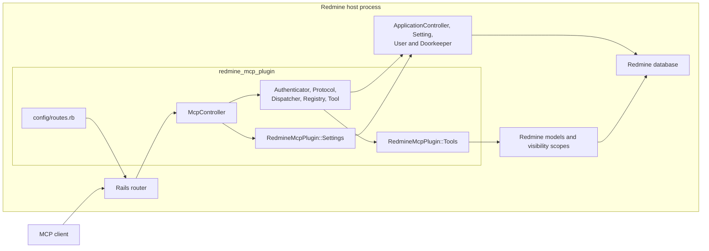
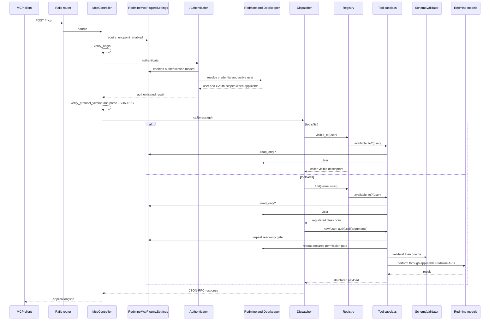

# Plugin architecture

This document describes the architecture implemented in this repository. The
plugin runs inside the Redmine process: it owns the MCP HTTP adapter and tools,
while Redmine supplies the application runtime, identities, authorization,
records, persistence, and test environment. Capabilities not represented below
are outside the current implementation.

For change-specific instructions, read the [MCP core agent guide](docs/mcp-core.md).

## Runtime boundary

The boxes inside `redmine_mcp_plugin` correspond to code owned here:

- [`config/routes.rb`](../config/routes.rb) mounts the transport, OAuth metadata,
  and optional dynamic-registration routes into the Rails router.
- [`McpController`](../app/controllers/mcp_controller.rb) is the HTTP and security
  boundary for `/mcp`.
- [`Authenticator`](../lib/redmine_mcp_plugin/authenticator.rb),
  [`Protocol`](../lib/redmine_mcp_plugin/protocol.rb),
  [`Dispatcher`](../lib/redmine_mcp_plugin/dispatcher.rb),
  [`Registry`](../lib/redmine_mcp_plugin/registry.rb), and
  [`Tool`](../lib/redmine_mcp_plugin/tool.rb) form the MCP core.
- Classes under [`RedmineMcpPlugin::Tools`](../lib/redmine_mcp_plugin/tools/) adapt
  MCP operations to Redmine models.
- [`RedmineMcpPlugin::Settings`](../lib/redmine_mcp_plugin/settings.rb) is a typed
  adapter over Redmine's plugin settings.

The remaining boxes are supplied by the host. Rails provides routing, controller
callbacks, rendering, and the `ApplicationController` base class. Redmine provides
`Setting`, `User`, permissions, models, visibility scopes, the database connection,
and the plugin loader. Redmine's Doorkeeper integration authenticates OAuth access
tokens. The plugin does not duplicate those services or maintain a separate user or
record store.

## MCP request flow

`POST /mcp` follows this path. The order is part of the security boundary.

The symbols in the sequence are implemented as follows:

1. The Rails router uses [`config/routes.rb`](../config/routes.rb) to send `POST`
   to `McpController#handle`. `GET` and `DELETE` reach `#stream` and `#terminate`,
   which return 405 after the shared controller gates because the server provides
   neither a server-to-client stream nor transport sessions.
2. `McpController` runs `require_endpoint_enabled`, `verify_origin`,
   `authenticate_mcp_request`, and `verify_protocol_version` in that order before
   `#handle` parses JSON. It rejects malformed JSON, batches, invalid JSON-RPC
   bodies that are not objects or lack a nonblank method, envelopes whose `jsonrpc`
   member is not `"2.0"`, and unsupported transport versions; notifications receive
   an empty 202 response.
3. `Authenticator#authenticate` tries only administrator-enabled mechanisms, in
   the order OAuth2, API key, HTTP Basic, then session cookie. It returns an active
   Redmine `User`; OAuth also copies the token scopes to that user and retains them
   in the request authentication context.
4. `McpController#verify_protocol_version` validates the
   `MCP-Protocol-Version` header and selects the fallback when the header is absent.
   `Protocol.negotiate_initialize` selects the version returned for an older
   client's `initialize` request, while `Protocol.decorate` adds result metadata.
   Supported revisions and the preferred and fallback revisions live in
   [`lib/redmine_mcp_plugin.rb`](../lib/redmine_mcp_plugin.rb).
5. After controller validation, `Dispatcher#call` handles `server/discover`,
   `initialize`, `tools/list`, `tools/call`, and `ping`. [`JsonRpc`](../lib/redmine_mcp_plugin/json_rpc.rb)
   builds response envelopes and error codes.
6. `Registry.all` is the explicit allowlist of tool classes. `Registry.visible_to`
   and `Registry.find` apply `Tool.available_to?` before listing or resolving a
   tool.
7. `Tool#call` repeats the write and permission gates, then invokes
   [`SchemaValidator`](../lib/redmine_mcp_plugin/schema_validator.rb) to reject or
   coerce arguments before calling the subclass's `#perform` method.
8. Each tool reads or writes through Redmine models. Tools use Redmine visibility
   APIs such as `Project.visible`, `Issue.visible`, `Principal.visible`,
   `WikiPage#visible?`, visible custom fields, and visible journals, together with
   `User#allowed_to?` where the operation requires a permission.

## Security invariants

These invariants span components and must remain true when any layer changes.

### Authentication precedes protocol execution

The controller rejects a disabled endpoint and a disallowed `Origin` before it
resolves credentials. It authenticates before protocol parsing and dispatch, so no
MCP method executes anonymously. Within `Authenticator`, only enabled modes are
attempted, in declared priority order. If a mode recognizes an explicit credential
and rejects it, authentication fails rather than trying a lower-priority mode.
`User.current` is set only from a successful result.

OAuth2, API-key, and HTTP Basic authentication require Redmine's REST API setting
to be enabled. Session authentication does not use that switch. If all plugin
authentication modes are disabled, authentication fails closed.

### Every supplied Origin is checked

`McpController#verify_origin` runs before authentication for every MCP request. An
absent `Origin` is accepted for non-browser clients. A supplied value must exactly
match the Redmine base URL or an entry in `Settings.allowed_origins`. This check is
also the cross-site request guard for optional session-cookie authentication,
whose Rails CSRF callback cannot protect token-oriented MCP requests.

### Read-only mode is enforced at discovery and execution

`Tool.available_to?` removes write tools from `tools/list` and prevents
`Registry.find` from resolving them while `Settings.read_only?` is true.
`Tool#call` independently refuses a write tool, so execution stays protected even
if a caller bypasses discovery or code later obtains a class directly. Read-only
mode defaults on.

### OAuth scopes narrow Redmine permissions

`Authenticator#try_oauth2` assigns the access token's scopes through
`User#oauth_scope=`. Availability and execution of tools with a declared
permission use `User#allowed_to?`, which therefore intersects Redmine role
permissions with the token's narrower grant. Tools that require a project-scoped
permission beyond a visible lookup call `Tool#authorize!` against the selected
project. API-key, Basic, and session modes have no additional OAuth scope
narrowing.

### Permissions and record visibility are separate gates

A declared tool permission controls whether the operation is available; Redmine
visibility APIs control which records it can observe. Both are required because
visibility scopes honor Redmine roles but do not apply a narrowed OAuth token, and
a permission check alone does not filter records. Record lookups start from a
visible scope, and project-specific operations additionally authorize against that
project where required. Nested data uses its own visibility API where Redmine
provides one.

Invisible and nonexistent records must remain indistinguishable. Helpers such as
`Tool#fetch_project` and tools such as `GetIssue` return the same not-found wording
for both cases, preventing existence probes.

### Hidden tools reveal no policy details

`Registry.find` searches only the caller-visible set. `Dispatcher#tools_call`
returns the same `Unknown tool` protocol error when a name is unregistered, hidden
by permissions, or hidden by read-only mode. Do not introduce an error branch that
lets a caller distinguish those cases.

### Internal failures are safe for clients

`Dispatcher#call` separates permission failures, actionable `ToolError` results,
and unexpected exceptions. Unexpected exceptions are logged server-side with
diagnostic detail, but the client receives only the fixed `Internal error` message.
Exception messages from Rails, Active Record, or the database must not cross that
boundary.

## OAuth metadata and dynamic registration

[`McpMetadataController`](../app/controllers/mcp_metadata_controller.rb) serves the
public protected-resource and authorization-server documents only when both the
MCP endpoint and OAuth mode are enabled. It derives permission scopes and PKCE
support from the host's Doorkeeper configuration and advertises dynamic
registration only when that setting is enabled.

[`DynamicClientRegistration`](../lib/redmine_mcp_plugin/dynamic_client_registration.rb)
loads `doorkeeper-openid_connect` during route drawing, avoiding the gem's early
controller binding. It exposes only the gem's registration controller and admits
public clients whose redirect URIs are all HTTPS or loopback. Its gate requires the
endpoint, OAuth mode, and dynamic registration setting to be enabled.

The plugin migration
[`CreateDoorkeeperOpenidConnectTables`](../db/migrate/20261007120000_create_doorkeeper_openid_connect_tables.rb)
adds the host-database structures required by that integration. It runs through
Redmine's plugin migration task and does not create a plugin-owned database.

## Loading and tests

Redmine adds `lib/` to the main Zeitwerk loader. Each path under
`lib/redmine_mcp_plugin/` defines its matching constant; explicit tool exposure is
still controlled separately by `Registry.all`. The external
`doorkeeper-openid_connect` gem is the documented lazy-load exception.

Tests run inside Redmine's test application. Unit tests cover protocol, settings,
schema validation, limits, and dynamic-registration policy. Functional tests cover
the HTTP gates, protocol responses, tool visibility, and record visibility.
Integration tests exercise registration and the OAuth authorization flow against
Redmine routes, models, fixtures, and database. Commands and host-checkout
requirements are defined in the repository [coding agent guide](../AGENTS.md).
