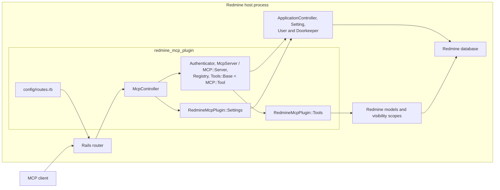
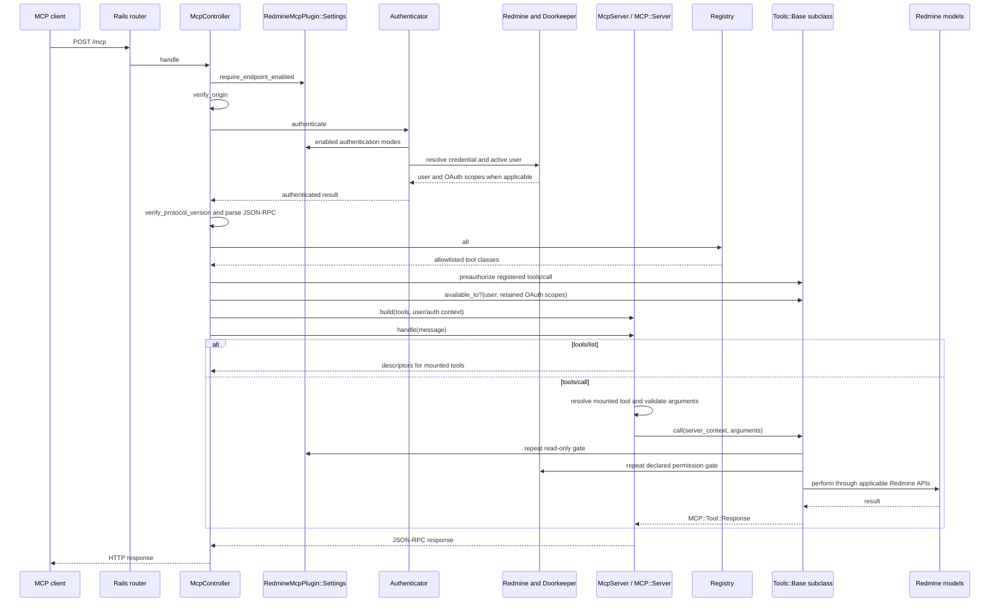

# Plugin architecture

This document describes the architecture implemented in this repository. The
plugin runs inside the Redmine process: it owns the MCP HTTP adapter and tools,
while Redmine supplies the application runtime, identities, authorization,
records, persistence, and test environment. Capabilities not represented below
are outside the current implementation.

For change-specific instructions, read the [MCP core agent guide](docs/mcp-core.md).

## Runtime boundary

The boxes inside `redmine_mcp_plugin` correspond to code owned here:

- [`config/routes.rb`](config/routes.rb) mounts the transport, OAuth metadata,
  and optional dynamic-registration routes into the Rails router.
- [`McpController`](app/controllers/mcp_controller.rb) is the HTTP and security
  boundary for `/mcp`.
- [`Authenticator`](lib/redmine_mcp_plugin/authenticator.rb),
  [`McpServer`](lib/redmine_mcp_plugin/mcp_server.rb),
  [`Registry`](lib/redmine_mcp_plugin/registry.rb), and
  [`Tools::Base`](lib/redmine_mcp_plugin/tools/base.rb) form the live MCP
  core around the SDK's `MCP::Server` and `MCP::Tool`.
- Classes under [`RedmineMcpPlugin::Tools`](lib/redmine_mcp_plugin/tools/) adapt
  MCP operations to Redmine models.
- [`RedmineMcpPlugin::Settings`](lib/redmine_mcp_plugin/settings.rb) is a typed
  adapter over Redmine's plugin settings.

The remaining boxes are supplied by the host. Rails provides routing, controller
callbacks, rendering, and the `ApplicationController` base class. Redmine provides
`Setting`, `User`, permissions, models, visibility scopes, the database connection,
and the plugin loader. Redmine's Doorkeeper integration authenticates OAuth access
tokens. The plugin does not duplicate those services or maintain a separate user or
record store.

## MCP request flow

`POST /mcp` follows this path. The order is part of the security boundary.

The symbols in the sequence are implemented as follows:

1. The Rails router uses [`config/routes.rb`](config/routes.rb) to send `POST`
   to `McpController#handle`. `GET` and `DELETE` reach `#stream` and `#terminate`,
   which return 405 after the shared controller gates because the server provides
   neither a server-to-client stream nor transport sessions.
2. `McpController` runs `require_endpoint_enabled`, `verify_origin`,
   `authenticate_mcp_request`, and `verify_protocol_version` in that order before
   `#handle` parses JSON. It rejects malformed JSON, batches, invalid JSON-RPC
   bodies that are not objects or lack a nonblank method, envelopes whose `jsonrpc`
   member is not `"2.0"`, and unsupported transport versions; notifications receive
   an empty 202 response.
3. `Authenticator#authenticate` tries only administrator-enabled mechanisms, in
   the order OAuth2, API key, HTTP Basic, then session cookie. It returns an active
   Redmine `User`; OAuth also copies the token scopes to that user and retains them
   in the request authentication context.
4. `McpController#verify_protocol_version` validates a supplied
   `MCP-Protocol-Version` header. The SDK negotiates `initialize` requests and
   modern per-request envelopes. Supported transport revisions live in
   [`lib/redmine_mcp_plugin.rb`](lib/redmine_mcp_plugin.rb).
5. `Registry.all` is the explicit allowlist of tool classes. For a registered
   `tools/call`, the controller resolves every permission required by that
   invocation, including argument-dependent permissions. It rejects read-only
   and role denials with a plain HTTP 403, or an OAuth scope denial with the
   challenge composed by
   [`ScopeChallenge`](lib/redmine_mcp_plugin/scope_challenge.rb). Unknown tool
   names continue to the SDK.
6. The controller applies `Tools::Base.available_to?` before mounting tools on
   a request-local server.
7. [`McpServer`](lib/redmine_mcp_plugin/mcp_server.rb) configures the SDK's
   exception reporter and builds an `MCP::Server` with the filtered tools plus
   the authenticated user and authorization context. `MCP::Server#handle`
   handles `server/discover`, `initialize`, `tools/list`, `tools/call`, `ping`,
   JSON-RPC errors, negotiation, and schema validation.
8. `Tools::Base#run` repeats the write and permission gates after SDK argument
   validation as a defense-in-depth backstop, then calls the subclass's
   `#perform` method.
9. Each tool reads or writes through Redmine models. Tools use Redmine visibility
   APIs such as `Project.visible`, `Issue.visible`, `Principal.visible`,
   `WikiPage#visible?`, visible custom fields, and visible journals, together with
   `User#allowed_to?` where the operation requires a permission.

### Transport-free SDK seam

The plugin does not mount an SDK transport. Rails routing, HTTP status codes,
authentication, Origin checks, request-body parsing, transport-version headers,
and response rendering remain in `McpController`. After those gates, the
controller passes the parsed message directly to `MCP::Server#handle` and renders
the returned Hash. `McpServer.build` is therefore the transport-free composition
seam: it supplies server identity, the exception reporter, caller-visible tool
classes, and the authenticated `server_context`, but no Rack, SSE, or session
adapter. Keep SDK-backed tools independent of Rails request and response objects.

### Error ownership

Errors retain one owner across the controller-to-SDK seam:

| Condition | Owner and wire result |
|---|---|
| Disabled endpoint, rejected Origin, or failed authentication | Controller HTTP error before MCP dispatch |
| Malformed JSON, a batch, an invalid JSON-RPC envelope, or an unsupported `MCP-Protocol-Version` header | Controller plus `JsonRpc`; HTTP 400 with the applicable JSON-RPC error |
| Unknown MCP method | SDK `MCP::Server#handle`; JSON-RPC method-not-found (`-32601`) |
| Registered tool denied by role or read-only mode | Controller; plain HTTP 403 with no scope challenge |
| Registered tool permitted by role but outside the OAuth token scope | Controller plus `ScopeChallenge`; HTTP 403 with an `insufficient_scope` challenge |
| Unknown tool | SDK `MCP::Server#handle`; JSON-RPC invalid-params (`-32602`) with the tool-not-found shape |
| SDK input-schema rejection | SDK tool result with `isError: true`; the tool body does not run |
| Expected `ToolError` or `PermissionError` from an executing tool | `Tools::Base#run`; `MCP::Tool::Response` encoded as a result with `isError: true` |
| Unexpected exception from an executing tool | SDK internal error (`-32603`); `McpServer` reports details to the Redmine log and the response stays sanitized |

Do not recreate SDK-owned envelopes or codes in plugin code. `JsonRpc` is limited
to errors that must be returned before `MCP::Server#handle` can safely run and to
recognizing notifications at the HTTP boundary.

## Security invariants

These invariants span components and must remain true when any layer changes.

### Authentication precedes protocol execution

The controller rejects a disabled endpoint and a disallowed `Origin` before it
resolves credentials. It authenticates before protocol parsing and dispatch, so no
MCP method executes anonymously. Within `Authenticator`, only enabled modes are
attempted, in declared priority order. If a mode recognizes an explicit credential
and rejects it, authentication fails rather than trying a lower-priority mode.
`User.current` is set only from a successful result.

OAuth2, API-key, and HTTP Basic authentication require Redmine's REST API setting
to be enabled. Session authentication does not use that switch. If all plugin
authentication modes are disabled, authentication fails closed.

### Every supplied Origin is checked

`McpController#verify_origin` runs before authentication for every MCP request. An
absent `Origin` is accepted for non-browser clients. A supplied value must exactly
match the Redmine base URL or an entry in `Settings.allowed_origins`. This check is
also the cross-site request guard for optional session-cookie authentication,
whose Rails CSRF callback cannot protect token-oriented MCP requests.

### Read-only mode is enforced at discovery and execution

`Tools::Base.available_to?` removes write tools before the request-local server
is built while `Settings.read_only?` is true. The controller also rejects a
forced call to a registered write tool with a plain HTTP 403 before SDK dispatch.
`Tools::Base#run` independently refuses a write tool, so execution stays
protected if the controller gate is bypassed or the setting changes after server
construction. Read-only mode defaults on.

### OAuth scopes narrow Redmine permissions

`Authenticator#try_oauth2` assigns the access token's scopes through
`User#oauth_scope=`. Discovery evaluates a tool's declared permission with that
scope narrowing temporarily cleared, then restores the retained scopes, so
`tools/list` reflects the user's role and exposes role-permitted tools for OAuth
step-up. For a registered `tools/call`, the controller first checks the role-only
axis for every permission the invocation requires. A role denial returns a plain
403 because no token can overcome it. If the role permits the operation but
`User#allowed_to?` fails with the retained OAuth scopes, the controller returns
`403 insufficient_scope` containing the complete operation scope set. For a
write operation whose administrator has no role-based path, the actionable scope
is `admin`, rather than individual permissions that cannot activate Redmine's
administrator authority. An admin-only read operation returns a plain 403 because
the only actionable scope is write-tier `admin`, which a read step-up must never
request. The authoritative correlation map and challenge format live in
[`ScopeChallenge`](lib/redmine_mcp_plugin/scope_challenge.rb). Its same-tier rule
prevents a read challenge from introducing write authority. The client can union
the challenged scopes with its current grant, re-authorize, and retry.

Tool execution still uses `User#allowed_to?` with the restored scopes as a
backstop and therefore intersects Redmine role permissions with the token's
narrower grant.
Tools that require a project-scoped permission beyond a visible lookup call
`Tools::Base#authorize!` against the selected project. API-key, Basic, and
session modes have no additional OAuth scope narrowing.

### Permissions and record visibility are separate gates

A tool's declared and argument-dependent permissions control whether the
operation is available; Redmine visibility APIs control which records it can
observe. Both are required because visibility scopes honor Redmine roles but do
not apply a narrowed OAuth token, and a permission check alone does not filter
records. Record lookups start from a visible scope, and project-specific
operations additionally authorize against that project where required. Nested
data uses its own visibility API where Redmine provides one.

Invisible and nonexistent records must remain indistinguishable. Helpers such as
`Tools::Base#fetch_project` and tools such as `GetIssue` return the same not-found
wording for both cases, preventing existence probes.

### Discovery hides tools denied by policy

Only caller-visible tools are mounted on the request-local `MCP::Server`. The SDK
therefore omits role-denied and read-only-blocked tools from `tools/list`. A forced
call to a registered but unavailable tool is intercepted before SDK dispatch and
returns the same plain 403 for either role or read-only denial, without a scope
hint that would reveal a futile step-up path. An unregistered name remains owned
by the SDK and returns its tool-not-found JSON-RPC error.

### Internal failures are safe for clients

`Tools::Base#run` converts permission failures and actionable `ToolError` failures
to tool results with `isError: true`. Unexpected exceptions propagate to the SDK,
which reports them through `McpServer` to the Redmine log while returning a
sanitized internal-error response. Exception messages from Rails, Active Record,
or the database must not cross that boundary.

## OAuth metadata and dynamic registration

[`McpMetadataController`](app/controllers/mcp_metadata_controller.rb) serves the
public protected-resource and authorization-server documents only when both the
MCP endpoint and OAuth mode are enabled. The protected-resource document
advertises only the minimal bootstrap scopes, while authorization-server
metadata derives the provider's supported scopes and PKCE support from the
host's Doorkeeper configuration. Scope enumeration failures fall back to the
bootstrap set. The controller advertises dynamic registration only when that
setting is enabled.

[`DynamicClientRegistration`](lib/redmine_mcp_plugin/dynamic_client_registration.rb)
loads `doorkeeper-openid_connect` during route drawing, avoiding the gem's early
controller binding. It exposes only the gem's registration controller and admits
public clients whose redirect URIs are all HTTPS or loopback. Its gate requires the
endpoint, OAuth mode, and dynamic registration setting to be enabled.

The plugin migration
[`CreateDoorkeeperOpenidConnectTables`](db/migrate/20261007120000_create_doorkeeper_openid_connect_tables.rb)
adds the host-database structures required by that integration. It runs through
Redmine's plugin migration task and does not create a plugin-owned database.

## Loading and tests

Redmine adds `lib/` to the main Zeitwerk loader. Each path under
`lib/redmine_mcp_plugin/` defines its matching constant; explicit tool exposure is
still controlled separately by `Registry.all`. Bundler eagerly requires the
external `mcp` gem so `MCP::Server` and `MCP::Tool` exist before plugin eager
loading. The other external-gem exception is `doorkeeper-openid_connect`, which is
declared with `require: false` and loaded lazily during dynamic route setup. These
opposite loading contracts are documented in [`PluginGemfile`](PluginGemfile).

Tests run inside Redmine's test application. Unit tests cover SDK server setup,
tool-base policy, settings, limits, and dynamic-registration policy. Functional
tests cover the HTTP gates, protocol responses, tool visibility, error mapping,
and record visibility.
Integration tests exercise registration and the OAuth authorization flow against
Redmine routes, models, fixtures, and database. Commands and host-checkout
requirements are defined in the repository [coding agent guide](AGENTS.md).
